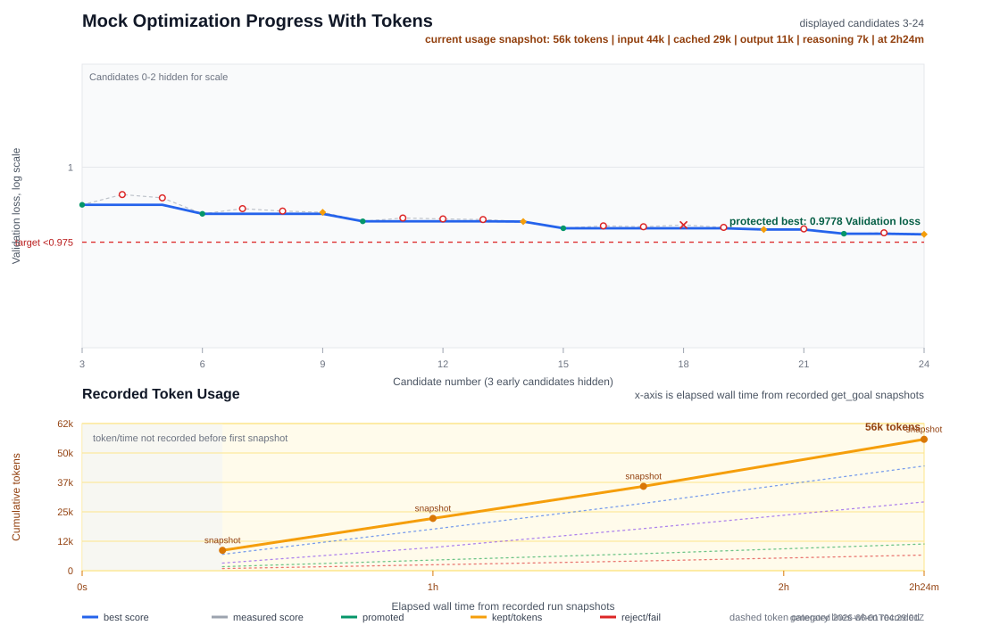

# Problem-Agnostic Optimization Skill

Codex skill for evidence-driven optimization across measured programs, CPU/GPU kernels, stochastic policy challenges, production latency/throughput targets, and leaderboard submissions.

The skill works best when the task starts with a clear `/goal`. Optimization is a long-running search problem; the agent needs an explicit objective, context, constraints, and stopping rule before it starts changing code.

## Quick Start

1. Install the skill using the commands in [Install](#install).
2. Start a new Codex session so the skill metadata is loaded.
3. For a real optimization run, paste a filled `/goal` block and ask Codex to use `problem-agnostic-optimization`.
4. The optimizer should deploy the isolated `work/optimization_harness/` harness immediately before baseline or candidate work. Missing harness files on a substantial run are a bug.
5. For a draft only, ask Codex to draft the full copy-paste prompt for later, including `Use problem-agnostic-optimization.`, and explicitly say not to start or activate it.
6. For long runs, open a second Codex session in auditor mode to review `work/optimization_harness/` progress without editing the active candidate.

Draft a goal without starting:

```text
Use problem-agnostic-optimization.

Draft a /goal block for later. Do not start or activate the goal yet.
The task is to solve the Anthropic's Original Performance Take-Home Challenge with a sub-1000-cycle solution (no index).
The metric is cycles. Check if you can find a baseline in the repo. No budget limit. Check the repo to obtain the rest of information.
```

## Use It With `/goal`

For any substantial optimization run, start with `/goal`.

Minimal form:

```text
/goal
Objective:
Authoritative metric:
Baseline:
Editable files:
Immutable files:
Budget / stopping rule:
Validation:
Progress chart: on
Fresh-run isolation: on
Multi-agent mode: off
```

Use the extended form when the run is noisy, remote, budget-limited, hardware-specific, or stochastic:

```text
/goal
Objective:
Context:
Target mode:
Authoritative metric:
Current baseline:
Editable files:
Immutable files:
Budget:
Validation:
Stopping rule:
Progress chart: on
Fresh-run isolation: on
Multi-agent mode: off
Notes:
```

Use concrete values. Avoid prompts like "make this faster" or "optimize this." The core loop is:

```text
contract -> baseline -> bottleneck model -> candidate -> validate/measure -> decide -> iterate or escape
```

Only the authoritative metric promotes; profiles, counters, local benchmarks, and static models explain.
Internally, the skill tracks the contract, current best, bottleneck model, and candidate ledger.

### Draft A Goal For Later

If you want Codex to prepare the `/goal` block without starting an optimization run, say that explicitly:

```text
Draft a /goal block for later. Do not start or activate the goal yet.

The task is <task>. The authoritative metric is <metric>. Baseline is <baseline or unknown>.
Editable files are <files>. Immutable files are <files>. Budget/stopping rule is <budget>.
Validation is <validation>.
```

The expected response is a filled copy-paste prompt, not an active goal. It must include the skill invocation line:

```text
Use problem-agnostic-optimization.

/goal
Objective:
Authoritative metric:
Baseline:
Editable files:
Immutable files:
Budget / stopping rule:
Validation:
Progress chart: on
Fresh-run isolation: on
Multi-agent mode: off
```

### Field Guide

- `Objective`: the measurable target. Example: "get p95 under 1 ms", "reach first place", "beat public best by 1%", or "maximize validation score under 1000 simulations".
- `Context`: the repo, problem, benchmark, hardware, service, leaderboard, or paper/reference that defines the task.
- `Target mode`: `production`, `clean leaderboard`, or another explicitly stated mode. Clean leaderboard still forbids exploit-like shortcuts.
- `Authoritative metric`: the command, submit path, dashboard, leaderboard, p95, score, or public evaluator that decides promotion.
- `Baseline` / `Current baseline`: current best artifact, score, command, commit, submission ID, or "unknown, reproduce first".
- `Editable files`: what Codex may change.
- `Immutable files`: reference implementations, graders, harnesses, datasets, scoring code, and anything else that must not be changed.
- `Budget` / `Budget / stopping rule`: submissions, GPU minutes, wall time, simulation count, API spend, max candidates, or target exit condition.
- `Validation`: correctness checks, seed protocol, shape sweep, test command, profiler/counter expectations, or production guardrails.
- `Stopping rule`: target reached, budget exhausted, blocker, plateau audit, or handoff after N candidates.
- `Progress chart`: defaults to `on` for substantial optimization runs. When on, Codex should keep harness files under the dedicated default directory `work/optimization_harness/`, including `progress.tsv`, `log.md`, `state.json`, `progress.svg`, `dashboard.html`, and `review.md`. Set `Progress chart: off` to skip chart/dashboard/review rendering.
- `Fresh-run isolation`: defaults to `on`. In a new assigned workspace, do not inspect sibling workspaces or prior run artifacts unless the user sets `Fresh-run isolation: off`.
- `Multi-agent mode`: defaults to `off`. Set `Multi-agent mode: on` only when several isolated hypotheses can run in parallel and a coordinator will serialize canonical writes and promotion.
- `Notes`: known failed attempts, public clues, constraints, tolerances, hidden-test risk, and anything that would make an optimization invalid.

## Prompt Templates

### Leaderboard Or Challenge

```text
/goal
Objective: Reach first place or beat the current public best on <leaderboard/problem>.
Context: <link>, repo path <path>, current candidate <file>.
Target mode: clean leaderboard.
Authoritative metric: public submit result from <command/service>; local runs are screening only.
Current baseline: <score/time/submission>, or reproduce first if unknown.
Editable files: <candidate files only>.
Immutable files: problem statement, checker, benchmark, reference, scoring code.
Budget: <N submissions or time limit>.
Validation: run correctness first when available; compare per-shape/per-case results; record variance.
Stopping rule: stop when first place is verified, budget is exhausted, or plateau audit says change hill.
Progress chart: on.
Fresh-run isolation: on.
Multi-agent mode: off.
Notes: no exploits, no wrong-answer speed, no harness edits.
```

### Production Optimization

```text
/goal
Objective: Reduce <p95/latency/cost/memory> from <baseline> to <target>.
Context: service/module <path>, workload <description>, production constraints <links>.
Target mode: production.
Authoritative metric: <benchmark/dashboard/load test command>.
Current baseline: <number, commit, command>.
Editable files: <implementation/config files>.
Immutable files: public API, correctness tests, datasets, benchmark contract.
Budget: <wall time, candidate count, risk window>.
Validation: tests, load test, profiling artifacts, p95/p99, error rate, rollback safety.
Stopping rule: target reached with stable validation, or handoff with bottleneck map.
Progress chart: on.
Fresh-run isolation: on.
Multi-agent mode: off.
Notes: maintainability and correctness beat benchmark-only tricks.
```

### Stochastic Policy Or Simulator

```text
/goal
Objective: Improve expected score from <baseline> to <target> under hidden/randomized scenarios.
Context: simulator/challenge <link or path>, submitted policy <file>.
Target mode: clean leaderboard or production.
Authoritative metric: <server score/public submit/official evaluation>.
Current baseline: mean <x>, SEM <y>, seed set <name>.
Editable files: policy/controller/config files.
Immutable files: simulator, scorer, seed generator, reference policies, submission protocol.
Budget: <simulations, submissions, wall time>.
Validation: smoke/train/validation/holdout/adversarial scenario sets; report mean, SEM, p05/p95, invalid rate, win rate vs parent.
Stopping rule: public score improves, holdout rejects candidate, budget exhausted, or overfit audit triggers.
Progress chart: on.
Fresh-run isolation: on.
Multi-agent mode: off.
Notes: compare parent and candidate on matched scenarios when possible.
```

## Multi-Agent Mode

Multi-agent mode is opt-in. Use `Multi-agent mode: on` only when the contract, protected best, and durable ledger already exist, and several candidate hypotheses can be tested from isolated parents.

The coordinator owns the canonical workspace and the dedicated harness directory, defaulting to `work/optimization_harness/`: `state.json`, `checkpoints/progress.json`, `best.md`, `log.md`, `progress.tsv`, candidate result JSON files, charts, dashboard, verifier gate, and promotion gate. Workers run in isolated worktrees or copied sandboxes, receive one candidate packet, and return evidence plus a patch/diff recommendation. Workers must not edit canonical ledgers, immutable files, harnesses, charts, dashboards, checkpoints, or final submissions.

Promotion remains serial: the coordinator applies at most one worker result at a time, checks parent staleness, reruns correctness and the authoritative metric in the canonical workspace, then logs the decision. Parallel workers are for throughput and search diversity, not for bypassing the authoritative promotion gate.

Use workers to diversify search allocation, not to multiply the same local tweak. Worker packets should include parent hash, mechanism class, target lane, duplicate check, hill status (`OPEN`, `NARROWED`, or `CLOSED`), and a push budget before reassessment.

## Progress Monitoring

For substantial optimization runs, progress monitoring is on by default. The optimizer should initialize `work/optimization_harness/progress.tsv`, `work/optimization_harness/log.md`, `work/optimization_harness/state.json`, `work/optimization_harness/checkpoints/progress.json`, and `work/optimization_harness/candidates/_template.result.json` before the first candidate, append one score row after every measured candidate, save a typed candidate result JSON, and regenerate `work/optimization_harness/progress.svg`, `work/optimization_harness/dashboard.html`, and `work/optimization_harness/review.md` after each row. Problem-local scratch files may still live elsewhere under `work/`; harness-created files should stay under the isolated harness directory unless `--work-dir` explicitly selects another dedicated path.

`work/optimization_harness/progress.svg` is a two-panel SVG dashboard:

- Top panel: authoritative score by candidate number, with auto log/linear scale, measured results, protected-best curve, promoted candidates, rejected candidates, kept ties, correctness failures, optional target line, and the current protected-best label. Candidates 0-2 are hidden by default when later candidates exist so startup work does not visually compress the real search.
- Bottom panel: token usage snapshots by elapsed wall time, using explicit `get_goal` snapshots recorded in `work/optimization_harness/log.md`. The chart marks the pre-snapshot region as unknown instead of interpolating or fabricating token history. If an old run has no explicit snapshots but has legacy token columns, the chart may render those as lower-confidence legacy data. The latest usage snapshot is read from `work/optimization_harness/state.json` and shown in the header.
- Footer: visible full URL linking back to the bundled `problem-agnostic-optimization` skill source.

Use `work/optimization_harness/progress.tsv` as the score ledger. New rows must include `timestamp`, `candidate`, `score` or another authoritative metric column, `decision`, `tokens_total`, `tokens_delta`, `wall_seconds`, and `label`. Timestamps must be UTC snapshots in `YYYY-MM-DDTHH:MM:SSZ` form. Token/time values may be blank when unavailable, but the columns should always be present. If candidate names contain unrelated digits, include `candidate_number`. Use the bundled writer when available; do not hand-write TSV rows unless the script is missing:

```bash
python skills/problem-agnostic-optimization/scripts/record_progress.py \
  --progress work/optimization_harness/progress.tsv \
  --candidate cand_0007 \
  --metric cycles=2226 \
  --decision promote \
  --tokens-total 4500 \
  --tokens-delta 1400 \
  --wall-seconds 1080 \
  --label "dependency-list scheduled vector kernel"
```

Add `--candidate-number 7` when the candidate name has unrelated digits and the TSV has a `candidate_number` column.

Refresh both the SVG chart and static dashboard with one command:

```bash
python skills/problem-agnostic-optimization/scripts/render_progress.py work/optimization_harness/progress.tsv \
  --chart-output work/optimization_harness/progress.svg \
  --dashboard-output work/optimization_harness/dashboard.html \
  --direction lower
```

For fast iteration, keep the critical path small: correctness, authoritative metric, one progress row, raw evidence path, and decision. Run chart/dashboard/review refresh as sidecar work when possible. Sidecar work may refresh derived artifacts in parallel, but it must not mutate `work/optimization_harness/best.md`, canonical promotion state, or final submission state.

Use `work/optimization_harness/log.md` for token/time snapshots. In Codex, always try to call `get_goal` after each measured candidate and paste or summarize the snapshot with UTC timestamp, elapsed wall time, total tokens, token delta since the previous snapshot when known, and all available token fields: input, cached input, output, reasoning output, cache creation, and cache read. Copy the latest snapshot into `work/optimization_harness/state.json` under `progress.latest_usage_snapshot`. If an existing run lacks early token snapshots, record only the current cumulative value going forward and mark earlier token history as unknown; do not invent per-candidate token deltas.

`work/optimization_harness/events.jsonl` is retained for backward compatibility with older runs and `record_event.py`. New runs should use `work/optimization_harness/progress.tsv` for score rows and `work/optimization_harness/log.md` for token snapshots. Legacy token columns in TSV or JSONL may be read and charted as labeled compatibility data only; new token history should come from explicit `get_goal` snapshots.

Only `baseline`, `promote`, and `promoted` rows update protected best. Use `keep` for retained evidence or ties that did not pass the canonical promotion gate. Meaningful promotions should pass the promotion ladder in `work/optimization_harness/promotion_ladder.md` and run, or explicitly limit, the fresh verifier gate in `work/optimization_harness/verifier.md`.

The dashboard is diagnostic. It can trigger push/reassess decisions, but it never replaces correctness checks or the authoritative promotion gate.

Fast harness bootstrap from an installed skill:

```bash
CODEX_HOME="${CODEX_HOME:-$HOME/.codex}"
python "$CODEX_HOME/skills/problem-agnostic-optimization/scripts/init_harness.py" \
  --objective "<objective>" \
  --metric "<authoritative metric>" \
  --baseline "<baseline or unknown, reproduce first>" \
  --budget "<budget / stopping rule>" \
  --validation "<validation command or protocol>" \
  --harness-mode standard \
  --multi-agent-mode off
```

This creates `work/optimization_harness/best.md`, `work/optimization_harness/log.md`, `work/optimization_harness/plan.md`, `work/optimization_harness/state.json`, `work/optimization_harness/events.jsonl`, `work/optimization_harness/progress.tsv`, `work/optimization_harness/progress.svg`, `work/optimization_harness/dashboard.html`, `work/optimization_harness/review.md`, `work/optimization_harness/audit.md`, `work/optimization_harness/checkpoints/progress.json`, `work/optimization_harness/candidates/_template.result.json`, `work/optimization_harness/schemas/candidate_result.schema.json`, `work/optimization_harness/promotion_ladder.md`, and `work/optimization_harness/verifier.md` before candidate work. `--harness-mode minimal|standard|audit` controls how much advisory sidecar work is expected. Use `--progress-chart off` only when the `/goal` says `Progress chart: off`.

```bash
python skills/problem-agnostic-optimization/scripts/render_progress.py work/optimization_harness/progress.tsv --direction lower
python skills/problem-agnostic-optimization/scripts/progress_chart.py work/optimization_harness/progress.tsv -o work/optimization_harness/progress.svg --direction lower
python skills/problem-agnostic-optimization/scripts/progress_chart.py work/optimization_harness/progress.tsv -o work/optimization_harness/progress.svg --direction lower --target 1000 --ylabel cycles
```

`render_progress.py` refreshes both `work/optimization_harness/progress.svg` and `work/optimization_harness/dashboard.html`. The chart separates optimization progress from resource burn. The score panel always uses candidate number on the x-axis, with `--score-scale auto|log|linear`. The token panel uses elapsed wall time from recorded snapshots. For exact golden tests or stable artifacts, set `--generated-at <iso timestamp>`, `--no-generated-at`, or `SOURCE_DATE_EPOCH`.

If a run has `Progress chart: on` but no progress artifacts, ask the optimizer to backfill `work/optimization_harness/progress.tsv` from `work/optimization_harness/log.md` and any saved result files, then continue appending `work/optimization_harness/progress.tsv` after every measured candidate and explicit `get_goal` snapshots to `work/optimization_harness/log.md`. Missing chart files should be treated as a harness bug, not as normal behavior.

## Progress Dashboard

For a fuller review surface, generate a dependency-free HTML dashboard from `work/optimization_harness/progress.tsv`. This creates a static HTML file, so it works even when Codex is running on a remote server:

```bash
python skills/problem-agnostic-optimization/scripts/progress_dashboard.py work/optimization_harness/progress.tsv \
  -o work/optimization_harness/dashboard.html \
  --direction lower
```

Open `work/optimization_harness/dashboard.html` in a browser, download it from the remote host, or attach it to a handoff. The static dashboard includes the two-panel SVG, current best, latest candidate, token/time burn, bug/blocker count, and recent candidate table. The dashboard wrapper accepts the same deterministic SVG controls: `--generated-at`, `--no-generated-at`, and `SOURCE_DATE_EPOCH`.

For live refresh on a local machine:

```bash
python skills/problem-agnostic-optimization/scripts/progress_dashboard.py work/optimization_harness/progress.tsv \
  --serve \
  --host 127.0.0.1 \
  --port 8765 \
  --direction lower
```

Open `http://127.0.0.1:8765`.

For live refresh on a remote server, keep the dashboard bound to `127.0.0.1` on the remote host and open an SSH tunnel from your local machine:

```bash
ssh -L 8765:127.0.0.1:8765 <user>@<remote-host>
```

Then open `http://127.0.0.1:8765` locally. If tunneling is inconvenient, use the static `work/optimization_harness/dashboard.html` path instead.

Mock chart generated with the same script:

```bash
python skills/problem-agnostic-optimization/scripts/progress_chart.py assets/mock-progress.tsv \
  -o assets/mock-progress.svg \
  --log assets/mock-log.md \
  --state assets/mock-state.json \
  --title "Mock Optimization Progress" \
  --ylabel "Validation loss" \
  --direction lower
```



## Audit Mode

For long optimization runs, start a second Codex session in auditor mode to review progress without disrupting the optimizer. The auditor reads the run artifacts and writes only `work/optimization_harness/audit.md` by default.

```text
Use problem-agnostic-optimization in auditor mode.

Read the current run artifacts and write/update only work/optimization_harness/audit.md.
Do not edit candidate code, harness files, work/optimization_harness/best.md, work/optimization_harness/log.md, work/optimization_harness/plan.md, work/optimization_harness/state.json, work/optimization_harness/events.jsonl, or work/optimization_harness/progress.tsv.
Do not launch new candidates, submissions, benchmarks, or long-running jobs unless I explicitly ask.

Audit whether the active optimization run is making valid progress under the recorded contract.
Check authoritative-metric promotion, correctness evidence, token/time burn, stagnation, blocker state, and whether the next planned candidate follows from the evidence.
```

Auditor mode uses `skills/problem-agnostic-optimization/references/auditor.md`. It should return one verdict: `ON TRACK`, `NEEDS REASSESSMENT`, `BLOCKED`, `INVALIDATED`, or `NEEDS USER DECISION`.

## Run Isolation

Fresh-run isolation is on by default. In a newly assigned workspace, Codex should use only the current workspace, the user-provided context, and the official target artifacts. It should not mine sibling workspaces, old candidate logs, prior submissions, or cached solutions unless `/goal` says `Fresh-run isolation: off` or the user explicitly asks for prior-run transfer.

This protects benchmark integrity while still allowing deliberate reuse when the task is a continuation or retrospective.

## Vendored Skill Snapshots

Repos that bundle a copy of this skill should record the upstream repository URL and commit SHA next to the snapshot. That makes downstream dashboards and optimization labs reproducible when the skill evolves.

## Install

Clone the repository and copy the skill directory into your Codex skills folder. The commands use `CODEX_HOME` when it is set, otherwise they install into `$HOME/.codex`.

```bash
git clone https://github.com/josusanmartin/problem-agnostic-optimization-skill.git
cd problem-agnostic-optimization-skill

CODEX_HOME="${CODEX_HOME:-$HOME/.codex}"
mkdir -p "$CODEX_HOME/skills"
rm -rf "$CODEX_HOME/skills/problem-agnostic-optimization"
cp -R skills/problem-agnostic-optimization "$CODEX_HOME/skills/"
```

If you previously edited the installed copy by hand, back it up before running the `rm -rf` line. Restart Codex, or start a new Codex session, after installing or updating the skill.

Check the installed files:

```bash
CODEX_HOME="${CODEX_HOME:-$HOME/.codex}"
test -f "$CODEX_HOME/skills/problem-agnostic-optimization/SKILL.md"
test -f "$CODEX_HOME/skills/problem-agnostic-optimization/agents/openai.yaml"
test -f "$CODEX_HOME/skills/problem-agnostic-optimization/scripts/init_harness.py"
test -f "$CODEX_HOME/skills/problem-agnostic-optimization/scripts/progress_chart.py"
test -f "$CODEX_HOME/skills/problem-agnostic-optimization/scripts/progress_dashboard.py"
test -f "$CODEX_HOME/skills/problem-agnostic-optimization/scripts/render_progress.py"
test -f "$CODEX_HOME/skills/problem-agnostic-optimization/scripts/record_event.py"
test -f "$CODEX_HOME/skills/problem-agnostic-optimization/scripts/record_progress.py"
test -f "$CODEX_HOME/skills/problem-agnostic-optimization/references/auditor.md"
```

The installed layout should be:

```text
$CODEX_HOME/skills/problem-agnostic-optimization/
  SKILL.md
  agents/
    openai.yaml
  scripts/
    init_harness.py
    progress_chart.py
    progress_dashboard.py
    render_progress.py
    record_event.py
    record_progress.py
  references/
    cpu-architecture.md
    auditor.md
    evidence-loop.md
    gpu-architecture.md
    harness.md
    problem-families.md
    resource-models.md
    stochastic-policy-search.md
    templates.md
```

Update an existing checkout and reinstall:

```bash
cd problem-agnostic-optimization-skill
git pull --ff-only

CODEX_HOME="${CODEX_HOME:-$HOME/.codex}"
rm -rf "$CODEX_HOME/skills/problem-agnostic-optimization"
cp -R skills/problem-agnostic-optimization "$CODEX_HOME/skills/"
```

## Validate

From the repository root:

```bash
python3 -m pip install -r requirements-dev.txt
./scripts/validate.sh
python3 -m pytest -q
```

The validator parses `SKILL.md` frontmatter and `agents/openai.yaml`, checks required files, and rejects non-ASCII skill content.

## Repository Layout

```text
skills/problem-agnostic-optimization/   # Codex skill payload
assets/                                 # README images and sample progress data
scripts/validate.sh                     # local validation helper
scripts/validate_skill.py               # structured validator implementation
tests/                                  # validator regression tests
README.md                               # repo documentation
LICENSE                                 # MIT license
```

## Acknowledgements

This skill is original work, but it incorporates general operating ideas inspired by:

- [multica-ai/andrej-karpathy-skills](https://github.com/multica-ai/andrej-karpathy-skills): simplicity-first edits, surgical changes, explicit assumptions, and goal-driven execution.
- [karpathy/autoresearch](https://github.com/karpathy/autoresearch): autonomous fixed-budget experiment loops, keep/discard discipline, compact result tracking, and evidence-managed search.

This project is not affiliated with either repository and does not copy their code.
